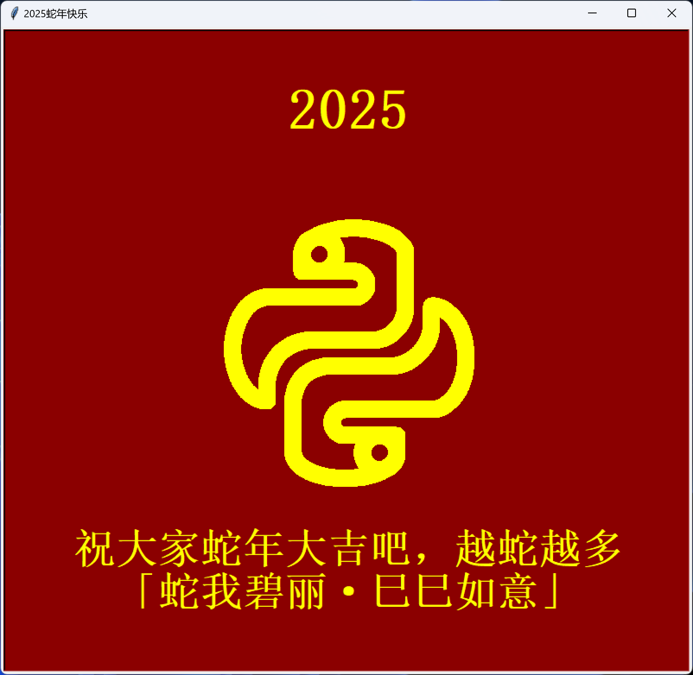
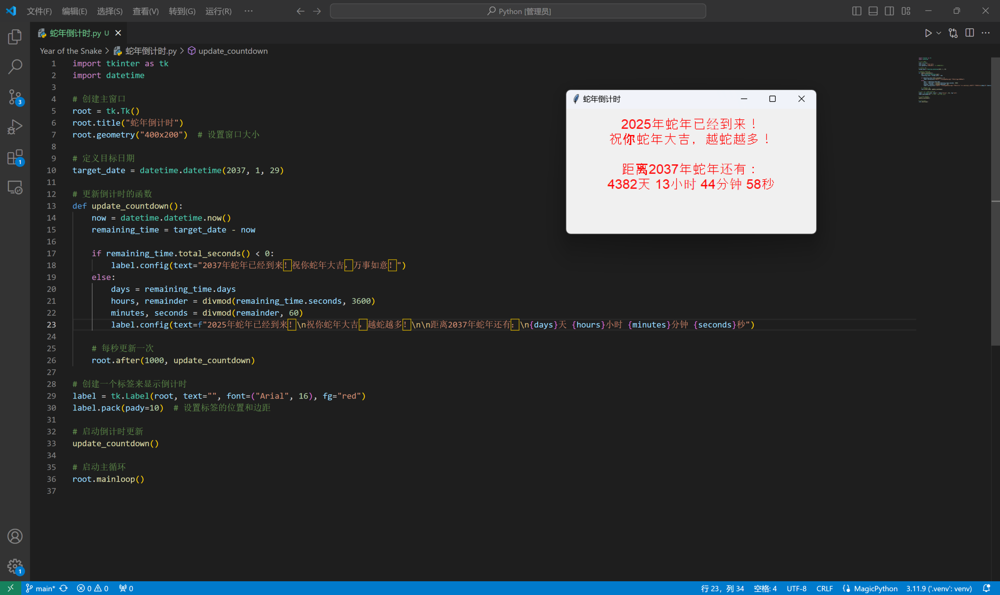

# Year of the Snake
 蛇年趣味程序

# turtle_python.py

效果预览：



椭圆绘制方法：
```python
import math, turtle

def draw_partial_ellipse(pen: turtle.Turtle, a, b, c, d, start_angle=0, end_angle=360, clockwise=True):
    """
    画椭圆
    参数:
    pen: 画笔
    a, b: 椭圆的水平、垂直方向的宽度的一半
    c, d: 椭圆的圆心x, y坐标
    start_angle, end_angle: 起始、结束角度
    clockwise: 是否顺时针绘制
    """
    pen.speed(0)
    pen.penup()

    if clockwise:
        if start_angle < end_angle:
            end_angle, start_angle = start_angle, end_angle
    else:
        if start_angle > end_angle:
            end_angle, start_angle = start_angle, end_angle

    start_radian = math.radians(start_angle)  
    x_start = a * math.cos(start_radian)
    y_start = b * math.sin(start_radian)
    pen.goto(x_start+c, y_start+d)  
    pen.pendown()  

    if clockwise:
        for theta in range(start_angle, end_angle - 1, -1):
            radian = math.radians(theta) 
            x = a * math.cos(radian)
            y = b * math.sin(radian)
            pen.goto(x+c, y+d)
    else:
        # 逆时针方向
        for theta in range(start_angle, end_angle + 1, 1):
            radian = math.radians(theta)
            x = a * math.cos(radian)
            y = b * math.sin(radian)
            pen.goto(x+c, y+d)
```

# 蛇年倒计时.py

使用tk制作



# 蛇年病毒.py

[qq频道链接](https://pd.qq.com/s/cl7kap7z1)

